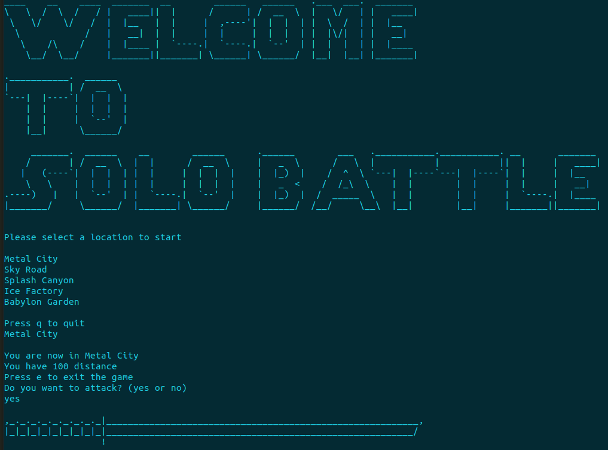

# Terminal Solo Battle


Terminal Solo Battle is a simple terminal game that implements [Djikstra's Algorithm](https://en.wikipedia.org/wiki/Dijkstra%27s_algorithm). It uses Dijkstra's Algorithm to grab the distance from each of the monster's location which then gets used to subtract the player's distance. Distance is pretty much like the player's health. The farther the player goes to each location, the less distance a player has to go to the next.

##### Note -- Depending on where you start, some locations are unreachable. In those cases, you are guaranteed to lose. So, choose wisely.



## Prerequisites

- [dotnet core](https://dotnet.microsoft.com/download)

## How to run

```bash
# Terminal.SoloBattle folder
$ cd src/Terminal.SoloBattle

# run cmd
$ dotnet run
```

## How to run tests

```bash
# Terminal.SoloBattle.UnitTests folder
$ cd tests/Terminal.SoloBattle.UnitTests

# run tests cmd
$ dotnet test
```
